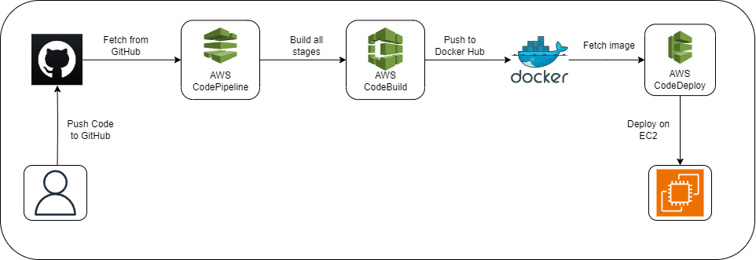

# Weather App CICD Deployment Using AWS DevOps

This repository contains a Go-based Weather Application that is built and deployed using AWS CodeBuild and CodeDeploy. The Docker image of the application is uploaded to Docker Hub, and the continuous integration and continuous deployment pipeline is orchestrated using AWS DevOps services.



## Table of Contents

- [Features](#features)
- [Architecture](#architecture)
- [Prerequisites](#prerequisites)
- [Installation](#installation)
- [Run](#run)
  - [With Go](#with-go)
  - [Docker Way](#docker-way)
- [Usage](#usage)
- [Directory Structure](#directory-structure)
- [Configure AWS Services](#configure-aws-services)
  - [Create an EC2 Instance](#create-an-ec2-instance)
  - [Create IAM Roles](#create-iam-roles)
- [Configure CodeBuild](#configure-codebuild)
  - [Create Credentials](#create-credentials)
- [Configure CodeDeploy](#configure-codedeploy)
- [Build and Deploy](#build-and-deploy)
- [Contributing](#contributing)
- [License](#license)

## Features

- Fetches current weather information using a public API.
- Displays weather data in a user-friendly web interface.
- Automated build and deployment pipeline using AWS CodeBuild and CodeDeploy.
- Dockerized application for easy deployment.

## Architecture
The architecture of the project involves the following components:

- **Go Application**: The core application written in Go.
- **Docker**: Containerizes the Go application.
- **Docker Hub**: Stores the Docker image.
- **AWS CodeBuild**: Builds the Docker image.
- **AWS CodeDeploy**: Deploys the Docker image to an EC2 instance or ECS service.

## Prerequisites

- Go programming language installed ([Installation guide](https://golang.org/doc/install))
- OpenWeatherMap API key ([Sign up](https://home.openweathermap.org/users/sign_up))
- AWS account with permissions to use CodeBuild, CodeDeploy, EC2, and IAM.
- Docker installed locally.
- Docker Hub account.

## Installation

1. Clone the repository:

    ```sh
    git clone https://github.com/ARUP-G/Weather-app.git
    ```

2. Navigate to the project directory:

    ```bash
    cd Weather-app
    ```

3. Install dependencies:

    ```bash
    go mod tidy
    ```

4. Set up your OpenWeatherMap API key:

    Replace the placeholder `"OPENWEATHERMAP_API_KEY"` in `main.go` with your actual API key in the `.env` file.

## Run
### With go
1. Run the Go server:

    ```bash
    go run main.go
    ```

2. Open a web browser and navigate to `http://localhost:8080/` to access the welcome page.

### Docker way

1. Build image
    ```sh
    docker build -t dockerhub-repo/weatherapp:tag .
    ```
2. Run image
    ```sh
    docker run -p 8080:8080 dockerhub-repo/weatherapp:tag 
    ```


## Usage

1. Welcome Page:

    - Upon accessing `http://localhost:8080/`, users will see a welcome message and a link to check the weather.

2. Weather Form:

    - Click on the "Check Weather" link to navigate to the weather form (`http://localhost:8080/weather-form.html`).
    - Enter the name of the city you want to check the weather for in the input field and click "Get Weather".
    - The current temperature and description of the weather will be displayed below the form.

## Directory Structure
```
├── wether-app/ # Main application code
│ ├── main.go # Entry point of the application and Logic for fetching weather data
│ └── .env file # for environment variable
├── static/ # Static for html files
│ ├── index.html # For welcome file
│ ├── weather-form.html # For weather search
├── buildspec.yml # Build specification for CodeBuild
├── appspec.yml # Deployment specification for CodeDeploy
├── scripts/ # Scripts for deployment lifecycle events
│ ├── start_container.sh # Tasks to perform before installation
│ ├── stop_container.sh # Tasks to perform after installation
└── README.md # This file
```
## Configure AWS Services

### Create an EC2 Instance
- Create an EC2 instance that will server as the deployment target Ensure you have:

- Installed the CodeDeploy agent.
- Configured the instance with the necessary IAM roles.

### Create IAM Roles
- Create IAM roles for CodeBuild and CodeDeploy with appropriate permissions.

## Configure CodeBuild
- Create a CodeBuild project:

### Create credentials 

- Go to AWS Systems Manager -> parameter Store
- Store all the necessary parameters for the CI part.


- Specify the source provider (e.g., GitHub).
- Set the build environment (choose a managed image with Go installed).
- Use the `buildspec.yml` file provided in the repository.


## Configure CodeDeploy

- Create a CodeDeploy application and deployment group:

- Specify the deployment group name.
- Choose the EC2/On-premises compute platform.
- Attach the IAM role created for CodeDeploy.
- Specify the EC2 instances to deploy the application.


## Build and Deploy

- Trigger the build and deploy process:

- Push your changes to the repository.
- CodeBuild will automatically start building the application based on the `buildspec.yml`.


- On successful build, CodeDeploy will deploy the application using the `appspec.yml` and lifecycle event scripts.


## Contributing

Contributions are welcome! Please feel free to submit issues and pull requests.

## License

This project is licensed under the [MIT License](LICENSE).
